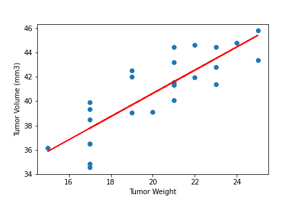

# Matplotlib Homework - The Power of Plots

### Mouse Study Data Analyis

1) Capomulin and Ramicane showed overall lowest tumor volume of all drug regimen's during the 45 day treatement trial. 
2) The potential outliners for Capomulin and Ramicane were significantly lower than the other drug regimen. This tells us that Capomulin and Ramicane were more likely to reduce the Tumor volume than other drug regimen. 
3) While Capomulin and Ramicane were mostly likely to reduce the tumor volume Capomulin and Ramicane had more Metastatic Sites for each had a total of 230. While Infubinol and Ceftamin each had a total of 178.

## Instructions

Your tasks are to do the following:

* Before beginning the analysis, check the data for any mouse ID with duplicate time points and remove any data associated with that mouse ID.

* Use the cleaned data for the remaining steps.

* Generate a summary statistics table consisting of the mean, median, variance, standard deviation, and SEM of the tumor volume for each drug regimen.

* Generate a bar plot using both Pandas's `DataFrame.plot()` and Matplotlib's `pyplot` that shows the total number of timepoints for all mice tested for each drug regimen throughout the course of the study.

  

* Generate a pie plot using both Pandas's `DataFrame.plot()` and Matplotlib's `pyplot` that shows the distribution of female or male mice in the study.

 

* Calculate the final tumor volume of each mouse across four of the most promising treatment regimens: Capomulin, Ramicane, Infubinol, and Ceftamin. Calculate the quartiles and IQR and quantitatively determine if there are any potential outliers across all four treatment regimens.

* Using Matplotlib, generate a box and whisker plot of the final tumor volume for all four treatment regimens and highlight any potential outliers in the plot by changing their color and style.

* Select a mouse that was treated with Capomulin and generate a line plot of tumor volume vs. time point for that mouse.

* Generate a scatter plot of tumor volume versus mouse weight for the Capomulin treatment regimen.

* Calculate the correlation coefficient and linear regression model between mouse weight and average tumor volume for the Capomulin treatment. Plot the linear regression model on top of the previous scatter plot.

